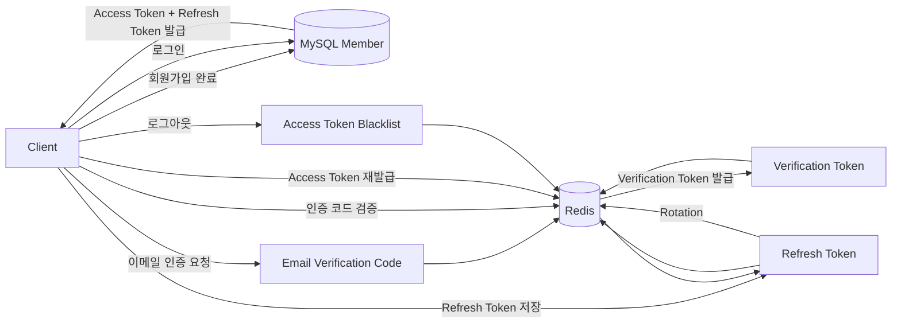

# DB Schema

본 문서는 실무 수준의 확장성, 유지보수성, 무결성을 고려하여 고도화된 최종 데이터베이스 스키마 명세서입니다.

---

## [공통 설계 원칙]

1. **타입 컨벤션 (ENUM 지양)**: 상태값은 DB의 ENUM 타입 대신 `VARCHAR`로 정의하고, 애플리케이션(Code) 단에서 상수/Enum으로 제어하여 DDL 변경 부담을 최소화합니다.

2. 데이터 삭제 정책 (Delete Policy)
   
   - **일반 데이터 (Soft Delete)**: 공고, 댓글 등의 일반 데이터는 `DeletedAt` 컬럼을 활용한 논리적 삭제를 적용하여 복구 및 이력 추적을 지원합니다.
   
   - **개인정보 및 회원 탈퇴 (Hard Delete & Anonymization)**: 개인정보보호를 위해 `Member` 데이터는 물리적 삭제(Hard Delete)를 원칙으로 합니다. 단, 회원이 작성한 공고/댓글/채팅 내역은 보존하며, 연관된 FK(`MemberId`)를 `NULL`로 업데이트(`ON DELETE SET NULL`)하여 애플리케이션 단에서 '알 수 없음'으로 처리합니다.

3. **공통 감사(Audit) 컬럼**: `CreatedAt`, `UpdatedAt`을 기본으로 포함하여 데이터의 생성 및 변경 이력을 추적합니다.

4. **비밀번호**: BCrypt 암호화

---

## 1. 도메인별 테이블 상세 명세

### 1.1 회원 및 이력서 도메인 (Member & Resume)

#### [Table: Member] - 회원의 기본 정보 저장

| 컬럼명             | 타입 / 제약조건       | 참조 (FK) | 설명                                                                   |
|:--------------- |:--------------- |:------- |:-------------------------------------------------------------------- |
| **Id**          | PK, Serial      | -       | 회원 고유 식별자                                                            |
| **Nick**        | VARCHAR, UNIQUE | -       | 서비스 내 닉네임                                                            |
| **Email**       | VARCHAR, UNIQUE | -       | 이메일 주소 (로그인 ID)                                                      |
| **PW**          | VARCHAR         | -       | 암호화된 비밀번호                                                            |
| **EXP**         | INT, DEFAULT 0  | -       | 활동 경험치 점수 (프로필의 경험치 바/레벨 산출에 사용. 적립 규칙은 추후 확정)                       |
| **CreatedAt**   | DATETIME        | -       | 계정 생성 일시                                                             |
| **UpdatedAt**   | DATETIME        | -       | 계정 수정 일시                                                             |
| **LastLoginAt** | DATETIME        | -       | 마지막 로그인 일시 (로그인 시 즉시 갱신, 자동 로그인은 Redis `lastUsedAt` 갱신 후 배치로 DB 동기화) |

#### [Table: SocialAccount] - 소셜 로그인 기능

| 컬럼명            | 타입 / 제약조건  | 참조 (FK)      | 설명                  |
| -------------- | ---------- | ------------ | ------------------- |
| **Id**         | PK, Serial | -            | 소셜 로그인 식별자          |
| **MemberId**   | FK         | `Member(Id)` | 연동된 계정              |
| **Provider**   | VARCHAR    | -            | 소셜 로그인 제공자          |
| **ProviderId** | VARCHAR    | -            | 소셜 로그인 제공자로부터 받은 Id |
| **CreatedAt**  | DATETIME   | -            | 연동 일시               |

##### 소셜 로그인 정책

| 항목        | 정책                                                                             |
|:--------- |:------------------------------------------------------------------------------ |
| 지원 Provider | **KAKAO만 지원**한다. (`LoginProvider`는 확장 가능하도록 유지)                                 |
| 소셜 신규 가입   | **불가.** 소셜은 가입 수단이 아니라 **로그인 편의 기능**이다.                                        |
| 연동 시점     | 이메일+비밀번호로 가입한 뒤, 프로필 화면에서 카카오를 **연동**해야 소셜 로그인을 사용할 수 있다.                      |
| 식별 키      | 이메일이 아니라 **`ProviderUserId`**(카카오 고유 id)를 사용한다. 이메일은 변경될 수 있고 카카오는 제공하지 않을 수 있다. |
| 카카오 이메일 동의 | **불필요.** 이미 가입된 계정에 연동만 하므로 고유 id 외 추가 동의 항목이 필요 없다.                           |
| 소셜 토큰 저장  | **저장하지 않는다.** 로그인 시점에 카카오 API로 검증하고 즉시 폐기한다.                                   |
| 토큰 검증     | 클라이언트가 보낸 카카오 Access Token은 **반드시 서버가 카카오 API로 재검증**한다. 검증 없이 신뢰하면 위조 로그인이 가능하다. |
| 연동 해제     | **지원한다.** `SocialAccount` row를 삭제한다. 모든 계정이 이메일+비밀번호를 가지므로 해제해도 로그인 불가 상태가 되지 않는다. |
| 계정당 연동 수  | Provider별 1개 (동일 Provider 중복 연동 불가)                                            |

```
[앱] 카카오 SDK 로그인 → Access Token 획득

      ↓ POST /auth/social/login { provider, accessToken }

[서버] 카카오 API로 토큰 검증 → ProviderUserId 획득

      ↓

[서버] SocialAccount(KAKAO, ProviderUserId) 조회

      ├─ 있음 → 해당 Member로 우리 JWT 발급
      └─ 없음 → 404 NOT_LINKED_ACCOUNT
                "프로필에서 카카오를 먼저 연동해주세요"
```

##### Referential Integrity Constraint

- ON DELETE CASCADE

##### Composite Constraint

- Unique(Provider, ProviderId) : 동일 소셜 플랫폼 계정이 중복 연동 X

#### [Table: Univ] - 대학교 기준 데이터 (Master Table)

| 컬럼명      | 타입 / 제약조건       | 참조 (FK) | 설명                    |
|:-------- |:--------------- |:------- |:--------------------- |
| **Id**   | PK, Serial      | -       | 대학교 ID                |
| **Name** | VARCHAR, UNIQUE | -       | 대학교 명칭 (예: 명지대학교)     |

##### 캠퍼스 정책

**캠퍼스는 구분하지 않는다.** 인문/자연, 서울/지역 캠퍼스를 모두 **하나의 학교**로 취급한다.

```
명지대학교 인문캠퍼스 + 명지대학교 자연캠퍼스 → "명지대학교" 1개 row
```

따라서 같은 대학교 소속이면 캠퍼스와 무관하게 교내(onCampus) 공고를 공유한다.

##### 데이터 관리

- 전국 대학 목록을 초기 시딩한다. (교육부/대학알리미 공공데이터 활용)
- 사용자는 목록에서 **선택만** 하며, 직접 입력하지 않는다.
- 학교명 표기가 통일되므로 `UnivId` 비교로 교내 여부를 정확히 판별할 수 있다.

#### [Table: MemberUniv] - 회원 학교 정보

| 컬럼명          | 타입 / 제약조건 | 참조 (FK)      | 설명                                                                          |
|:------------ |:--------- |:------------ |:--------------------------------------------------------------------------- |
| **MemberId** | PK, FK    | `Member(Id)` | 회원 고유 식별자 (1:1 매핑)                                                          |
| **UnivId**   | FK        | `Univ(Id)`   | 소속 대학교 (마스터에서 **선택**)                                                       |
| **Major**    | VARCHAR   | -            | 전공 학과 명칭 (사용자 **직접 입력**, 2~50자)                                             |
| **Status**   | VARCHAR   | -            | 학적 상태 (`ENROLLED`, `LEAVE_OF_ABSENCE`, `GRADUATION_DEFERRED`, `GRADUATED`) |

##### 학교 / 전공 입력 방식

| 항목 | 방식             | 이유                                       |
|:-- |:-------------- |:---------------------------------------- |
| 학교 | 마스터에서 선택 (FK)  | 표기 흔들림 방지. 교내(onCampus) 공고 필터링이 정확히 동작해야 함 |
| 전공 | 사용자 직접 입력      | 학과는 수가 많고 신설·통폐합·개명이 잦아 마스터 유지보수가 비현실적임   |

##### Referential Integrity Constraint

- MemberId, ON DELETE CASCADE
- UnivId, ON DELETE RESTRICT (사용 중인 대학교는 삭제 불가)

#### [Table: MemberResume] - 사용자의 프로필 및 상세 이력서

| 컬럼명              | 타입 / 제약조건 | 참조 (FK)      | 설명        |
|:---------------- |:--------- |:------------ |:--------- |
| **MemberId**     | PK, FK            | `Member(Id)` | 회원 고유 식별자                       |
| **Hope**         | VARCHAR           | -            | 희망 진로 (100자 이하)                    |
| **Strength**     | TEXT              | -            | 본인의 장점 (사용자 직접 입력)               |
| **AboutMe**      | TEXT              | -            | 자기소개 본문 (**AI가 자동 생성**, 사용자 미입력) |
| **CreatedAt**    | DATETIME  | -            | 최초 생성 일시  |
| **UpdatedAt**    | DATETIME  | -            | 최종 수정 일시  |

##### Referential Integrity Constraint

- ON DELETE CASCADE

##### Resume 구성 (사용자 입력 항목)

프로필(Resume)은 다음 정보를 사용자로부터 입력받아 구성한다.

| 입력 항목        | 저장 위치                              |
|:------------ |:---------------------------------- |
| 학교 (선택)      | `MemberUniv.UnivId` → `Univ`       |
| 전공 (입력)      | `MemberUniv.Major`                 |
| 학적 상태        | `MemberUniv.Status`                |
| 희망 진로        | `MemberResume.Hope`                |
| 관심 주제        | `DetailTopic`                      |
| 장점           | `MemberResume.Strength`            |
| 수상 및 경험      | `DetailExperience`                 |
| 기술 스택 + 숙련도  | `MemberTechStack` (Level 1~3)      |
| 외부 링크        | `AdditionalLink` + `LinkCategory`  |
| 자격증 + 취득일자   | `MemberLicense` (Acquired)         |

##### 프로필 = 이력서 (Resume)

본 서비스에서 **프로필과 이력서는 같은 것**이다. 마이페이지의 프로필 탭에서 이력서 형태로 조회된다.

##### AboutMe 생성 정책

| 시점       | 동작                                                        |
|:-------- |:--------------------------------------------------------- |
| 최초 생성 시  | 위 입력 항목을 기반으로 **AI가 `AboutMe`만 자동 생성**한다. 사용자는 입력하지 않는다.   |
| 최초 생성 이후 | 사용자가 **이력서를 직접 수정**한다. `AboutMe`도 직접 수정하며 **AI 재생성은 하지 않는다.** |

즉 AI는 최초 1회 `AboutMe` 초안을 만들어주는 역할만 하며, 이후 이력서 관리 주체는 사용자다.

프로필 이미지 및 학년(Grade)은 사용하지 않는다.

#### [Table: TechStack] - 기술 스택 기준 데이터 (Master Table)

| 컬럼명      | 타입 / 제약조건  | 참조 (FK) | 설명                                      |
|:-------- |:---------- |:------- |:--------------------------------------- |
| **Id**   | PK, Serial | -       | 기술 스택 고유 식별자                            |
| **Name** | VARCHAR    | -       | 스킬/툴 이름 (예: React, Spring, Figma)       |
| **Type** | VARCHAR    | -       | 'SKILL'(프레임워크/언어) 또는 'TOOL'(디자인/협업툴) 구분 |

#### [Table: MemberTechStack] - 사용자 보유 기술 스택 매핑

| 컬럼명             | 타입 / 제약조건 | 참조 (FK)         | 설명                 |
|:--------------- |:--------- |:--------------- |:------------------ |
| **MemberId**    | PK, FK    | `Member(Id)`    | 회원 고유 식별자          |
| **TechStackId** | PK, FK    | `TechStack(Id)` | 기술 스택 고유 식별자       |
| **Level**       | INT       | -               | 능력의 등급(1 / 2 / 3 ) |

##### Referential Integrity Constraint

- MemberId, ON DELETE CASCADE

#### [Table: License] - 자격증 목록 (Master Table)

| 컬럼명      | 타입 / 제약조건  | 참조 (FK) | 설명                           |
| -------- | ---------- | ------- | ---------------------------- |
| **Id**   | PK, Serial | -       | 자격증 식별 번호                    |
| **Name** | VARCHAR    | -       | 자격증 이름 (예: SQLD, ADsP, 컴활 등) |

#### [Table: MemberLicense] - 사용자 보유 자격증

| 컬럼명           | 타입 / 제약조건 | 참조 (FK)       | 설명         |
| ------------- | --------- | ------------- | ---------- |
| **MemberId**  | PK, FK    | `Member(Id)`  | 회원 고유 식별자  |
| **LicenseId** | PK, FK    | `License(Id)` | 자격증 고유 식별자 |
| **Acquired**  | DATE      | -             | 사용자 취득 일자  |

##### Referential Integrity Constraint

- MemberId, ON DELETE CASCADE

#### [Table: AdditionalLink] - 외부 포트폴리오 링크

| 컬럼명           | 타입 / 제약조건  | 참조 (FK)            | 설명        |
|:------------- |:---------- |:------------------ |:--------- |
| **Id**        | PK, Serial | -                  | 링크 식별자    |
| **MemberId**  | FK         | `Member(Id)`       | 링크 소유자    |
| **LinkCatId** | FK         | `LinkCategory(Id)` | 플랫폼 카테고리  |
| **URL**       | VARCHAR    | -                  | 실제 연결 URL |

##### Referential Integrity Constraint

- MemberId, ON DELETE CASCADE

#### [Table: LinkCategory] - 외부 링크 카테고리 (Master Table)

| 컬럼명        | 타입 / 제약조건  | 참조 (FK) | 설명                        |
|:---------- |:---------- |:------- |:------------------------- |
| **Id**     | PK, Serial | -       | 카테고리 식별자 (예: Git, Notion) |
| **Name**   | VARCHAR    | -       | 플랫폼 이름                    |
| **PicURL** | VARCHAR    | -       | 플랫폼 브랜드 로고 이미지 URL        |

#### [Table: DetailExperience] - 경험 및 이력 상세 (구조화)

| 컬럼명              | 타입 / 제약조건         | 참조 (FK)      | 설명                    |
|:---------------- |:----------------- |:------------ |:--------------------- |
| **Id**           | PK, Serial        | -            | 이력 식별자                |
| **MemberId**     | FK                | `Member(Id)` | 회원 식별자                |
| **Title**        | VARCHAR           | -            | 활동명 / 직무명 / 수상명       |
| **Organization** | VARCHAR, NULLABLE | -            | 소속/주관 기관명             |
| **Description**  | TEXT              | -            | 구체적인 수행 내용            |
| **StartDate**    | DATE              | -            | 수행 시작일                |
| **EndDate**      | DATE, NULLABLE    | -            | 수행 종료일 (진행중인 경우 NULL) |
| **CreatedAt**    | DATETIME          | -            | 생성 일시                 |
| **UpdatedAt**    | DATETIME          | -            | 수정 일시                 |

##### Referential Integrity Constraint

- ON DELETE CASCADE

#### [Table: DetailTopic] - 사용자의 관심 주제 매핑

| 컬럼명          | 타입 / 제약조건 | 참조 (FK)      | 설명        |
|:------------ |:--------- |:------------ |:--------- |
| **MemberId** | PK, FK    | `Member(Id)` | 회원 고유 식별자 |
| **TopicId**  | PK, FK    | `Topic(Id)`  | 주제 고유 식별자 |

##### Referential Integrity Constraint

- MemberId, ON DELETE CASCADE

---

### 1.2 모집 및 지원 도메인 (Recruitment & Application)

#### [Table: Recruit] - 구인/모집 공고

| 컬럼명              | 타입 / 제약조건          | 참조 (FK)      | 설명                                             |
|:---------------- |:------------------ |:------------ |:---------------------------------------------- |
| **Id**           | PK, Serial         | -            | 공고 식별자                                         |
| **MemberId**     | FK, NULLABLE       | `Member(Id)` | 작성자 ID                                         |
| **Title**        | VARCHAR            | -            | 공고 제목                                          |
| **Status**       | VARCHAR            | -            | 상태 (`OPEN`, `CLOSED`, `ADDITIONAL`)           |
| **OnCampus**     | BOOLEAN            | -            | 교내공고인지 교외 공고인지                                 |
| **StartDate**    | DATE               | -            | 진행기간 시작일                                       |
| **EndDate**      | DATE               | -            | 진행기간 마감일                                       |
| **Simple**       | VARCHAR            | -            | 한 줄 소개                                         |
| **Content**      | TEXT               | -            | 공고 상세 본문                                       |
| **TargetCount**  | INT                | -            | 모집인원                                           |
| **CurrentCount** | INT                | -            | 현재 참여중인 인원 (지원 수락 시 +1, 팀원 이탈/퇴출 시 -1)          |
| **CreatedAt**    | DATETIME           | -            | 생성 일시                                          |
| **UpdatedAt**    | DATETIME           | -            | 수정 일시                                          |
| **DeletedAt**    | DATETIME, NULLABLE | -            | 삭제 일시 (Soft Delete)                            |

##### Referential Integrity Constraint

- MemberId, ON DELETE SET NULL

### [Table: Apply] - 지원서 내역

> 지원서의 공식 명칭은 **Apply**로 통일한다. (엔티티/테이블/API 리소스 모두 `apply`)
> 상태 Enum은 `ApplyStatus`(WAITING / ACCEPTED / REJECTED)를 사용한다.

| 컬럼명           | 타입 / 제약조건    | 참조 (FK)       | 설명                                        |
|:------------- |:------------ |:------------- |:----------------------------------------- |
| **Id**        | PK, Serial   | -             | 지원서 고유 식별자 (`ApplyId`)                    |
| **RecruitId** | FK           | `Recruit(Id)` | 대상 공고                                     |
| **MemberId**  | FK, NULLABLE | `Member(Id)`  | 지원자                                       |
| **Message**   | TEXT         | -             | 전송할 메시지                                   |
| **Status**    | VARCHAR      | -             | 합격 여부 (`WAITING`, `ACCEPTED`, `REJECTED`) |
| **CreatedAt** | DATETIME     | -             | 지원 일시                                     |
| **UpdatedAt** | DATETIME     | -             | 상태 변경 일시                                  |

##### Referential Integrity Constraint

- MemberId, ON DELETE SET NULL
- RecruitID, ON DELETE CASCADE

##### Composite Constraint

- Unique(RecruitId, MemberId) : 중복지원 X

#### [Table: ApplyKeywordCategory] - 지원 키워드 카테고리 (Master Table)

| 컬럼명      | 타입 / 제약조건  | 참조 (FK) | 설명                              |
|:-------- |:---------- |:------- |:------------------------------- |
| **Id**   | PK, Serial | -       | 카테고리 ID                         |
| **Name** | VARCHAR    | -       | 카테고리명 (예: 실행력/책임감, 기획/아이디어, 전문 스킬) |

#### [Table: ApplyKeyword] - 지원 키워드 (Master Table)

| 컬럼명            | 타입 / 제약조건  | 참조 (FK)                    | 설명                       |
|:-------------- |:---------- |:-------------------------- |:------------------------ |
| **Id**         | PK, Serial | -                          | 키워드 ID                   |
| **CategoryId** | FK         | `ApplyKeywordCategory(Id)` | 소속 카테고리                  |
| **Content**    | VARCHAR    | -                          | 키워드 문구 (예: "마감기한 잘 지켜요") |

##### Referential Integrity Constraint

- CategoryId, ON DELETE CASCADE

> 프론트는 카테고리 → 키워드의 **Nested Dropdown**으로 표시한다. (`GET /apply-keywords`)
> AI 피드백용 `Keyword` 테이블과는 용도가 다르다(지원 어필 vs 평가 결과). 별도로 관리한다.

#### [Table: ApplyKeywordMap] - 지원서 ↔ 선택 키워드 매핑

| 컬럼명           | 타입 / 제약조건 | 참조 (FK)          | 설명       |
|:------------- |:--------- |:---------------- |:-------- |
| **ApplyId**   | PK, FK    | `Apply(Id)`      | 지원서      |
| **KeywordId** | PK, FK    | `ApplyKeyword(Id)` | 선택한 키워드  |

##### Referential Integrity Constraint

- ApplyId, ON DELETE CASCADE
- KeywordId, ON DELETE CASCADE

##### 정책

- 지원 시 **전체 카테고리를 통틀어 최대 5개**까지 선택할 수 있다.
- 선택한 키워드는 전송 메시지와 함께 공고 작성자에게 전달되고, 지원자 상세(자세히 보기)에 표시된다.

#### [Table: RecruitScrap] - 공고 스크랩(북마크)

| 컬럼명           | 타입 / 제약조건 | 참조 (FK)       | 설명        |
|:------------- |:--------- |:------------- |:--------- |
| **MemberId**  | PK, FK    | `Member(Id)`  | 스크랩한 회원   |
| **RecruitId** | PK, FK    | `Recruit(Id)` | 스크랩 대상 공고 |
| **CreatedAt** | DATETIME  | -             | 스크랩 일시    |

##### Referential Integrity Constraint

- MemberId, ON DELETE CASCADE
- RecruitId, ON DELETE CASCADE

##### Composite Constraint

- PK(MemberId, RecruitId) : 동일 공고 중복 스크랩 X

#### [Table: Category] - 공고 카테고리 (Master Table)

| 컬럼명      | 타입 / 제약조건  | 참조 (FK) | 설명                              |
|:-------- |:---------- |:------- |:------------------------------- |
| **Id**   | PK, Serial | -       | 카테고리 ID (예: 1: 공모전, 2: 프로젝트, 3: 스터디) |
| **Name** | VARCHAR    | -       | 카테고리 명칭                         |

> 교내/교외 구분은 Category가 아니라 `Recruit.OnCampus`(BOOLEAN) 컬럼으로 관리한다.

##### 교내(onCampus) 공고 노출 규칙

`OnCampus = true` 공고는 **작성자와 같은 대학교 소속 회원에게만** 노출된다.

```
노출 조건 : 작성자.MemberUniv.UnivId == 조회자.MemberUniv.UnivId
```

- 캠퍼스는 구분하지 않으므로, 같은 대학교면 캠퍼스가 달라도 노출된다.
- 학교 정보가 없는 회원(프로필 미작성)과 비회원에게는 교내 공고가 노출되지 않는다.
- `OnCampus = false`(교외) 공고는 모든 사용자에게 노출된다.
> Category 마스터 데이터에서 '교내' 항목은 제거한다.

#### [Table: RecruitCategory] - 공고 카테고리 매핑

| 컬럼명            | 타입 / 제약조건 | 참조 (FK)        | 설명       |
|:-------------- |:--------- |:-------------- |:-------- |
| **RecruitId**  | PK, FK    | `Recruit(Id)`  | 공고 식별자   |
| **CategoryId** | PK, FK    | `Category(Id)` | 카테고리 식별자 |

##### Referential Integrity Constraint

- RecruitId, ON DELETE CASCADE

#### [Table: Topic] - 프로젝트 주제 (Master Table)

| 컬럼명      | 타입 / 제약조건  | 참조 (FK) | 설명                           |
|:-------- |:---------- |:------- |:---------------------------- |
| **Id**   | PK, Serial | -       | 주제 고유 식별자 (예: 1: 기획, 2: 디자인) |
| **Name** | VARCHAR    | -       | 주제 명칭                        |

#### [Table: RecruitTopic] - 공고별 주제 매핑

| 컬럼명           | 타입 / 제약조건 | 참조 (FK)       | 설명     |
|:------------- |:--------- |:------------- |:------ |
| **RecruitId** | PK, FK    | `Recruit(Id)` | 공고 식별자 |
| **TopicId**   | PK, FK    | `Topic(Id)`   | 주제 식별자 |

##### Referential Integrity Constraint

- RecruitId, ON DELETE CASCADE

#### [Table: Comment] - 공고 질의응답 댓글

| 컬럼명                 | 타입 / 제약조건          | 참조 (FK)       | 설명                    |
|:------------------- |:------------------ |:------------- |:--------------------- |
| **Id**              | PK, Serial         | -             | 댓글 식별자                |
| **RecruitId**       | FK                 | `Recruit(Id)` | 댓글이 위치한 공고            |
| **MemberId**        | FK, NULLABLE       | `Member(Id)`  | 작성자                   |
| **ParentCommentId** | FK, NULLABLE       | `Comment(Id)` | 대댓글 상위 ID (Self Join) |
| **Content**         | TEXT               | -             | 댓글 내용                 |
| **CreatedAt**       | DATETIME           | -             | 작성 일시                 |
| **UpdatedAt**       | DATETIME           | -             | 수정 일시                 |
| **DeletedAt**       | DATETIME, NULLABLE | -             | 삭제 일시 (Soft Delete)   |

##### Referential Integrity Constraint

- RecruitId, ON DELETE CASCADE
- MemberId, ON DELETE SET NULL

---

### 1.3 프로젝트 도메인 (Project Lifecycle)

#### [Table: Project] - 공고 등록 후 실제 작동하는 프로젝트 본체

| 컬럼명           | 타입 / 제약조건      | 참조 (FK)       | 설명                                                                     |
|:------------- |:-------------- |:------------- |:---------------------------------------------------------------------- |
| **Id**        | PK, Serial     | -             | 프로젝트 고유 식별자                                                            |
| **RecruitId** | FK, NOT NULL   | `Recruit(Id)` | 파생된 공고 ID                                                              |
| **Name**      | VARCHAR        | -             | 팀명 / 프로젝트명 (그룹 채팅방 생성 시 입력한 **채팅방 이름**을 저장)                            |
| **Status**    | VARCHAR        | -             | 진행 상태 (`IN_PROGRESS`, `END`)                                          |
| **StartDate** | DATE           | -             | 활동 시작일                                                                 |
| **EndDate**   | DATE, NULLABLE | -             | 활동 종료일 (연장 시 갱신)                                                       |
| **EndCheckedAt** | DATETIME, NULLABLE | -      | 종료 확인 알림을 보낸 시각 (3일 유예 기산점)                                            |
| **CreatedAt** | DATETIME       | -             | 프로젝트 생성 일시                                                             |
| **UpdatedAt** | DATETIME       | -             | 상태 수정 일시                                                               |

##### Referential Integrity Constraint

- RecruitId, ON DELETE CASCADE

##### 생성 규칙 (Recruit → Project 전환)

Project는 자동으로 생성되지 않는다.

**공고 작성자가 그룹 채팅을 생성하는 시점**에 Project로 전환된다.

```
공고 작성(Recruit, OPEN)

↓

지원자 수락(Apply, ACCEPTED)

↓

작성자가 그룹 채팅 생성

↓

Project 생성 (Status = IN_PROGRESS) + ChatRoom(GROUP) 생성 + ProjectMember 등록
Recruit.Status 는 변경하지 않는다 (OPEN 유지 가능)

↓

팀 활동 중 팀원 이탈 발생 시

↓

Recruit.Status = ADDITIONAL (추가 모집)

↓

진행기간(EndDate) 도달 → 프로젝트장에게 종료 확인 알림 (연장 / 종료)

↓

3일 내 무응답 시 자동 종료

↓

Project.Status = END → 상호평가
```

##### 프로젝트 종료 정책

| 단계 | 내용                                                              |
|:-- |:--------------------------------------------------------------- |
| 1  | `EndDate` 도달 시 배치가 프로젝트장에게 종료 확인 알림 발송, `EndCheckedAt` 기록       |
| 2  | 프로젝트장은 **연장**(EndDate 갱신) 또는 **즉시 종료** 중 선택                     |
| 3  | `EndCheckedAt` 기준 **3일** 내 응답이 없으면 배치가 `Status = END` 로 자동 전환   |
| 4  | 연장한 경우 `EndCheckedAt`을 NULL로 초기화하고, 새 `EndDate` 도달 시 1단계를 반복한다  |

- 전환 시 작성자는 `ProjectMember.IsLeader = TRUE`로 등록된다.
- 전환 시 `ACCEPTED` 상태의 지원자가 모두 `ProjectMember`로 등록된다.
- **그룹 채팅방(=프로젝트) 개설은 공고를 마감시키지 않는다.** 공고는 그대로 모집을 이어갈 수 있다.
- 프로젝트 생성 이후, 모집중(OPEN)이든 추가모집(ADDITIONAL)이든 **수락된 지원자는 자동으로 기존 그룹 채팅방과 Project에 합류**한다.
- 공고 마감은 별도다: 진행기간(EndDate) 만료 또는 작성자의 수동 마감으로만 CLOSED가 된다.
- 프로젝트 생성에는 `ACCEPTED` 상태의 지원자가 최소 1명 필요하다. (혼자서는 프로젝트 생성 불가)
- **단, `Project.Status = END`로 전환된 이후에는 해당 공고를 추가 모집(3-5, `Recruit.Status = ADDITIONAL`)으로 전환할 수 없다.** 프로젝트가 이미 종료되어 더 이상 합류할 팀이 없기 때문이다.

#### [Table: ProjectMember] - 프로젝트 실제 참여자 명단

| 컬럼명           | 타입 / 제약조건              | 참조 (FK)       | 설명          |
|:------------- |:---------------------- |:------------- |:----------- |
| **Id**        | PK, Serial             | -             | 참여 이력 식별자   |
| **ProjectId** | FK                     | `Project(Id)` | 소속 프로젝트     |
| **MemberId**  | FK                     | `Member(Id)`  | 팀원 ID       |
| **IsLeader**  | BOOLEAN, DEFAULT FALSE | -             | 팀장 여부 플래그   |
| **JoinedAt**  | DATETIME               | -             | 합류 일시       |
| **LeftAt**    | DATETIME, NULLABLE     | -             | 중도 하차 / 퇴출 일시 (NULL이면 참여 중) |

##### Referential Integrity Constraint

- ProjectId, ON DELETE CASCADE
- MemberId, ON DELETE SET NULL

---

### 1.4 일정, 소통 및 알림 도메인 (Schedule, Chat & Notification)

#### [Table: MemberSchedule] - 개인 일정 관리

| 컬럼명           | 타입 / 제약조건         | 참조 (FK)                | 설명                     |
|:------------- |:----------------- |:---------------------- |:---------------------- |
| **Id**        | PK, Serial        | -                      | 일정 식별자                 |
| **MemberId**  | FK                | `Member(Id)`           | 일정 소유 회원 ID            |
| **StartDate** | DATE              | -                      | 반복 적용 범위 시작일           |
| **EndDate**   | DATE              | -                      | 반복 적용 범위 종료일           |
| **StartTime** | TIME              | -                      | 하루 중 일정 시작 시간          |
| **EndTime**   | TIME              | -                      | 하루 중 일정 종료 시간          |
| **RRULE**     | VARCHAR, NULLABLE | -                      | 표준(RFC 5545) 반복 규칙 문자열 |
| **ExDate**    | TEXT, NULLABLE    | -                      | 반복 일정에서 제외할 날짜 목록 (콤마 구분, RFC 5545 EXDATE) |
| **Title**     | VARCHAR           | -                      | 일정 제목 (예: 알바, 전공 수업)   |
| **Content**   | TEXT, NULLABLE    | -                      | 상세 내용                  |
| **SCId**      | FK                | `ScheduleCategory(Id)` | 어떤 카테고리를 설정했는지         |

##### Referential Integrity Constraint

- MemberId, ON DELETE CASCADE
- SCId, ON DELETE SET NULL

##### 단발 / 반복 일정 구분

| 구분    | RRULE | StartDate / EndDate |
|:----- |:----- |:------------------- |
| 단발 일정 | NULL  | 동일한 날짜 (하루)          |
| 반복 일정 | 값 존재  | 반복 적용 범위의 시작일 / 종료일  |

API는 단발(`/single`)과 반복(`/recurring`)을 별도 엔드포인트로 분리한다.

##### RRULE 운용 정책

| 항목        | 정책                                                                     |
|:--------- |:---------------------------------------------------------------------- |
| 단발 일정     | `RRULE = NULL`. 별도 표현 불필요                                              |
| 반복 일정     | RFC 5545 RRULE 문자열로 저장 (예: `FREQ=WEEKLY;BYDAY=MO,WE`)                  |
| 무한 반복     | **금지.** `EndDate`가 필수이므로 반복은 항상 유한하다                                   |
| 특정 회차 제외  | `ExDate`에 해당 날짜를 추가한다. (예: 매주 월요일 알바 중 시험 주간만 제외)                      |
| 특정 회차만 수정 | **미지원.** 수정은 반복 전체에 적용된다. 한 회차만 바꾸려면 `ExDate`로 제외한 뒤 단발 일정을 새로 만든다     |
| 조회 시 전개   | RRULE은 SQL로 조회할 수 없다. **조회 범위(월별 캘린더, 회의 조율 기간) 내에서만 애플리케이션이 전개**한다     |
| 전개 라이브러리  | ical4j 등 표준 라이브러리를 사용한다. 직접 구현하지 않는다 (격주/월말/윤년 처리)                      |

```
DB에는 규칙 문자열만 저장된다

   "FREQ=WEEKLY;BYDAY=MO,WE"

        ↓ 조회 범위 내에서 전개

   7/6(월), 7/8(수), 7/13(월), 7/15(수) ...

        ↓ ExDate 적용

   7/13 제외 → 7/6, 7/8, 7/15 ...
```

#### [Table: ScheduleCategory] - 일정 카테고리 설정

| 컬럼명          | 타입 / 제약조건  | 참조 (FK)      | 설명              |
| ------------ | ---------- | ------------ | --------------- |
| **Id**       | PK, Serial | -            | 카테고리 식별자        |
| **MemberId** | FK         | `Member(Id)` | 카테고리를 설정한 회원 ID |
| **Title**    | VARCHAR    | -            | 사용자가 설정한 카테고리명  |
| **Color**    | VARCHAR    | -            | 사용자가 설정한 색상 값   |

##### Referential Integrity Constraint

- MemberId, ON DELETE CASCADE

#### [Table: PartySchedule] - 팀 최종 확정 일정

| 컬럼명           | 타입 / 제약조건         | 참조 (FK)       | 설명                     |
|:------------- |:----------------- |:------------- |:---------------------- |
| **Id**        | PK, Serial        | -             | 팀 일정 식별자               |
| **ProjectId** | FK                | `Project(Id)` | 해당 프로젝트 식별자            |
| **StartDate** | DATE              | -             | 팀 일정 적용 시작일            |
| **EndDate**   | DATE              | -             | 팀 일정 적용 종료일            |
| **StartTime** | TIME              | -             | 시작 시간                  |
| **EndTime**   | TIME              | -             | 종료 시간                  |
| **RRULE**     | VARCHAR, NULLABLE | -             | 표준(RFC 5545) 반복 규칙 문자열 |
| **ExDate**    | TEXT, NULLABLE    | -             | 반복 일정에서 제외할 날짜 목록 (콤마 구분, RFC 5545 EXDATE) |
| **Title**     | VARCHAR           | -             | 일정 제목 (예: 정기 스크럼 회의)   |
| **Content**   | TEXT, NULLABLE    | -             | 회의 안건 또는 상세 내용         |

##### Referential Integrity Constraint

- ProjectId, ON DELETE CASCADE

### 팀 회의 일정 조율 (Meeting Poll)

팀 일정은 팀원이 임의로 등록하지 않고, **회의 일정 조율 절차**를 거쳐 확정한다.

```
1. 프로젝트장이 회의 개설
   - 회의명 / 소요 시간 / 탐색 기간 / 탐색 시간대 / 응답 마감 (기본 12시간, 조정 가능)

2. 시스템이 30분 단위 후보 슬롯 자동 생성

3. 각 팀원이 슬롯별로 가능 / 불가를 표시하고 1회 제출
   - 개인 캘린더에 일정이 있으면 해당 슬롯이 '불가'로 **미리 체크된 상태**로 제공
   - 캘린더가 비어 있어도 화면에서 직접 불가 시간을 체크하면 되므로
     **개인 일정 등록을 강제하지 않는다**

4. 전원 응답 완료 또는 마감 시각 도달 → 자동 집계

5. 참여 가능 인원이 많은 순으로 정렬해 프로젝트장에게 제시
   → **프로젝트장이 최종 확정**

6. PartySchedule 등록 + 전원 캘린더 반영 + 알림
```

#### 설계 원칙

| 원칙                | 내용                                                       |
|:----------------- |:-------------------------------------------------------- |
| 캘린더는 초기값일 뿐       | 응답 화면의 체크가 유일한 진실이다. 캘린더 미등록자도 정상적으로 참여할 수 있다.            |
| 팀원 액션은 1회         | 슬롯 가능/불가를 한 화면에서 표시하고 제출한다. 투표 라운드를 나누지 않는다.              |
| 미응답자는 집계에서 제외     | 미응답을 '가능'으로도 '불가'로도 간주하지 않고, 화면에 **미응답으로 그대로 노출**한다.      |
| 최종 확정은 프로젝트장      | 자동 확정하지 않는다. 동점인 경우에도 프로젝트장이 판단한다.                        |

##### 미응답자 표시 예시

```
화 14:00~16:00   가능 3명 / 미응답 1명
수 10:00~12:00   가능 4명
```

미응답자가 있는 슬롯을 확정하려 하면 경고를 표시한다.

##### 리마인더

응답 마감 3시간 전, 아직 응답하지 않은 팀원에게 알림을 발송한다. (배치)

#### [Table: MeetingPoll] - 회의 일정 조율

| 컬럼명             | 타입 / 제약조건    | 참조 (FK)             | 설명                                       |
|:--------------- |:------------ |:------------------- |:---------------------------------------- |
| **Id**          | PK, Serial   | -                   | 조율 식별자                                   |
| **ProjectId**   | FK           | `Project(Id)`       | 해당 프로젝트                                  |
| **CreatedBy**   | FK           | `Member(Id)`        | 조율을 시작한 프로젝트장                            |
| **Title**       | VARCHAR      | -                   | 회의명 (20자 이하)                            |
| **Status**      | VARCHAR      | -                   | `COLLECTING`, `CONFIRMED`, `CANCELLED`   |
| **DurationMin** | INT          | -                   | 회의 소요 시간(분) — 30 / 60 / 90 / 120         |
| **RangeStart**  | DATE         | -                   | 후보 탐색 시작일                                |
| **RangeEnd**    | DATE         | -                   | 후보 탐색 종료일                                |
| **DayStart**    | TIME         | -                   | 후보 탐색 시작 시각 (예: 09:00)                   |
| **DayEnd**      | TIME         | -                   | 후보 탐색 종료 시각 (예: 22:00)                   |
| **Deadline**    | DATETIME     | -                   | 응답 마감 시각 (**기본 생성 시각 + 12시간**, 프로젝트장 조정 가능) |
| **ScheduleId**  | FK, NULLABLE | `PartySchedule(Id)` | 확정된 팀 일정 (확정 전 NULL)                     |
| **CreatedAt**   | DATETIME     | -                   | 생성 일시                                    |
| **ReminderSentAt** | DATETIME, NULLABLE | -             | 응답 마감 3시간 전 리마인더 발송 시각 (중복 발송 방지, 미발송이면 NULL) |

##### Referential Integrity Constraint

- ProjectId, ON DELETE CASCADE
- CreatedBy, ON DELETE CASCADE
- ScheduleId, ON DELETE SET NULL

##### 제약

- 프로젝트당 `COLLECTING` 상태의 조율은 **1개만** 존재할 수 있다.
- 확정(`CONFIRMED`) 이후에도 프로젝트장이 **취소하고 다시 조율**할 수 있다. (재조율)
  취소 시 `Status = CANCELLED`, 연결된 `PartySchedule`은 삭제된다.

#### [Table: MeetingPollMember] - 조율 참여자별 응답 여부

> 조율 개설 시 **참가 명단을 선택**할 수 있다. 팀원 전원이 아니라 회의에 필요한 일부만 조율 대상으로 등록할 수 있다.
> 여기 등록된 팀원만 응답 대상이 되고, 후보 시간 산출·집계도 이들 기준으로 이루어진다.

| 컬럼명             | 타입 / 제약조건          | 참조 (FK)            | 설명            |
|:--------------- |:------------------ |:------------------ |:------------- |
| **PollId**      | PK, FK             | `MeetingPoll(Id)`  | 조율 식별자        |
| **MemberId**    | PK, FK             | `Member(Id)`       | 팀원 식별자        |
| **Responded**   | BOOLEAN            | -                  | 응답 제출 여부      |
| **RespondedAt** | DATETIME, NULLABLE | -                  | 응답 제출 시각      |

##### Referential Integrity Constraint

- PollId, ON DELETE CASCADE
- MemberId, ON DELETE CASCADE

#### [Table: MeetingPollSlot] - 회의 시간 후보 슬롯

| 컬럼명         | 타입 / 제약조건  | 참조 (FK)           | 설명                    |
|:----------- |:---------- |:----------------- |:--------------------- |
| **Id**      | PK, Serial | -                 | 슬롯 식별자                |
| **PollId**  | FK         | `MeetingPoll(Id)` | 조율 식별자                |
| **StartAt** | DATETIME   | -                 | 슬롯 시작 일시              |
| **EndAt**   | DATETIME   | -                 | 슬롯 종료 일시 (소요 시간 반영)   |

##### Referential Integrity Constraint

- PollId, ON DELETE CASCADE

##### 슬롯 생성 규칙

- 탐색 기간 × 탐색 시간대를 **30분 단위**로 나누어 슬롯을 생성한다.
- **When2meet 방식**으로, 전체 슬롯을 격자(그리드)로 모두 노출한다. 후보를 잘라내지 않는다.
- 집계 시 각 슬롯의 참여 가능 인원을 농도(히트맵)로 표시한다.
- 팀장이 최종 확정할 때만, 가능 인원이 많은 순으로 **추천 정렬**하여 선택을 보조한다.

#### [Table: MeetingPollAvailability] - 슬롯별 가능 / 불가 응답

| 컬럼명           | 타입 / 제약조건 | 참조 (FK)               | 설명                    |
|:------------- |:--------- |:--------------------- |:--------------------- |
| **SlotId**    | PK, FK    | `MeetingPollSlot(Id)` | 슬롯 식별자                |
| **MemberId**  | PK, FK    | `Member(Id)`          | 팀원 식별자                |
| **Available** | BOOLEAN   | -                     | 가능(true) / 불가(false)  |

##### Referential Integrity Constraint

- SlotId, ON DELETE CASCADE
- MemberId, ON DELETE CASCADE

##### 응답 및 집계 규칙

- 응답 화면은 **모든 슬롯이 '가능'인 상태**로 초기화된다.
- 개인 캘린더(`MemberSchedule`)에 일정이 있는 슬롯은 **'불가'로 미리 체크**되어 제공된다. (반복 일정은 전개하여 판정)
- 팀원은 이를 수정한 뒤 1회 제출한다. 캘린더가 비어 있어도 직접 체크하면 되므로 개인 일정 등록은 강제되지 않는다.
- 슬롯별 `가능 인원 = Available = true 인 응답 수`
- **미응답자는 가능/불가 어느 쪽으로도 집계하지 않으며, 미응답 인원으로 별도 표시한다.**

#### [Table: PartyScheduleAttendance] - 팀 일정(회의) 참석 여부

확정된 팀 일정(회의)에 대해 각 팀원이 참석 / 불참을 표시한다.

| 컬럼명           | 타입 / 제약조건 | 참조 (FK)               | 설명                    |
|:------------- |:--------- |:--------------------- |:--------------------- |
| **ScheduleId** | PK, FK   | `PartySchedule(Id)`   | 팀 일정 식별자              |
| **MemberId**   | PK, FK   | `Member(Id)`          | 팀원 식별자                |
| **Attending**  | BOOLEAN  | -                     | 참석(true) / 불참(false)  |
| **UpdatedAt**  | DATETIME | -                     | 참석 여부 변경 시각           |

##### Referential Integrity Constraint

- ScheduleId, ON DELETE CASCADE
- MemberId, ON DELETE CASCADE

##### 정책

- 회의 조율로 확정된 일정과 **프로젝트장이 직접 등록한 일정 모두** 참석/불참 대상이다. (동일 취급)
- 기본값은 참석(true)이며, 팀원이 회의 관리 탭에서 자신의 참석 여부를 변경할 수 있다.
- 참석 여부를 바꾸면 그룹 채팅방에 시스템 메시지가 발송된다. (예: "○○ 회의에 △△님이 불참합니다")
- 참석/불참 변경은 **회의 삭제와 무관**하다. 불참자가 있어도 회의 일정 자체는 유지된다.

#### [Table: ProjectScheduleCategory] - 팀 일정에 적용할 개인 카테고리 매핑

> 프로젝트에 합류한 팀원은 각자 해당 프로젝트의 팀 일정을 자신의 캘린더에서 어떤 색상으로 볼지 지정한다.
> 지정하지 않은 경우 기본 색상으로 표시된다.

| 컬럼명           | 타입 / 제약조건 | 참조 (FK)                | 설명                  |
|:------------- |:--------- |:---------------------- |:------------------- |
| **SCId**      | FK, PK    | `ScheduleCategory(Id)` | SheduleCategory 식별자 |
| **ProjectId** | FK, PK    | `Project(Id)`          | 해당 프로젝트 식별자         |

Referential Integrity Constraint

- ProjectId, ON DELETE CASCADE
- SCId, ON DELETE CASCADE

#### [Table: ChatRoom] - 채팅방 메타 관리

##### - 세부 Chat 내역, MongoDB에 저장

| 컬럼명           | 타입 / 제약조건            | 참조 (FK)       | 설명                   |
|:------------- |:-------------------- |:------------- |:-------------------- |
| **Id**        | PK, Serial           | -             | 채팅방 고유 식별자                                  |
| **Type**      | VARCHAR              | -             | `DIRECT`(1:1) 또는 `GROUP`(프로젝트 팀)            |
| **ProjectId** | FK, UNIQUE, Nullable | `Project(Id)` | GROUP인 경우 프로젝트와 1:1 매핑, DIRECT인 경우 NULL     |
| **CreatedAt** | DATETIME             | -             | 채팅방 생성 일시                                    |

##### 생성 규칙

- **GROUP**: 공고 작성자가 그룹 채팅을 생성하는 시점에 `Project`와 함께 생성된다. (= 프로젝트 전환 트리거)
- **DIRECT**: 사용자가 특정 상대에게 처음 개인 메시지를 보낼 때 생성된다. 이미 존재하면 기존 방을 재사용한다.

##### Composite Constraint

- DIRECT 채팅방은 동일한 두 사용자 간 1개만 존재한다. (애플리케이션 레벨에서 보장)

##### Referential Integrity Constraint

- ProjectId, ON DELETE SET NULL

#### [Table: ChatRoomMember] - 채팅 멤버 관리

| 컬럼명            | 타입 / 제약조건  | 참조 (FK)        | 설명               |
| -------------- | ---------- | -------------- | ---------------- |
| **Id**                | PK, Serial         | -              | 채팅방 멤버 식별자                       |
| **ChatRoomId**        | FK                 | `ChatRoom(Id)` | 소속 채팅방 Id                        |
| **MemberId**          | FK                 | `Member(Id)`   | 해당 채팅방에 참여하는 사용자                 |
| **LastReadMessageId** | VARCHAR, NULLABLE  | -              | 마지막으로 읽은 메시지의 MongoDB ObjectId    |
| **LastReadAt**        | DATETIME, NULLABLE | -              | 마지막으로 읽은 시각                       |
| **JoinedAt**          | DATETIME           | -              | 채팅방 참여 일시                         |
| **NotiEnabled**       | BOOLEAN            | -              | 이 채팅방의 알림 수신 여부 (기본 true)         |

##### 읽음 처리 정책

읽음 여부를 메시지마다 저장하지 않고, **사용자별 읽음 커서 1개**만 저장한다.

```
unreadCount = 해당 채팅방에서 LastReadMessageId 이후에 생성된 메시지 수
```

갱신 시점

| 방식              | 설명                                    |
|:--------------- |:------------------------------------- |
| WebSocket read 이벤트 | 사용자가 채팅방을 보고 있는 동안 실시간 갱신 (기본)         |
| REST `PATCH /chatrooms/{id}/read` | 채팅방 입장 시 명시적 호출 (재접속·앱 재시작 보정용) |

> GET 조회는 서버 상태를 변경하지 않는다(멱등성 유지). 읽음 갱신은 위 두 경로로만 수행한다.

##### 채팅방별 알림 정책

- 전역 채팅 알림(`NotificationSetting.ChatNoti`)이 **OFF면 모든 채팅방 알림을 받지 않는다.**
- 전역이 ON일 때, 채팅방별 `NotiEnabled`로 방마다 개별 on/off 한다.
- 즉 실제 알림 발송 조건은 `ChatNoti == true AND ChatRoomMember.NotiEnabled == true`

##### 채팅방 나가기 정책

- **DIRECT**: 사용자가 나가면 해당 `ChatRoomMember` row를 삭제한다. 나간 사용자의 목록에서는 방이 사라지고, 남은 상대방 화면에서는 상대가 **'알 수 없음'** 으로 표시된다. (메시지 내역은 유지)
- **GROUP**: 프로젝트 나가기/퇴출과 연동되어 함께 삭제된다.

##### Referential Integrity Constraint

- ChatRoomId, ON DELETE CASCADE
- MemberId, ON DELETE CASCADE

#### [Table: NotificationSetting] - 사용자별 알림 수신 동의 설정

| 컬럼명               | 타입 / 제약조건 | 참조 (FK)      | 설명                  |
|:----------------- |:--------- |:------------ |:------------------- |
| **MemberId**      | PK, FK    | `Member(Id)` | 회원 고유 식별자           |
| **ChatNoti**      | BOOLEAN   | -            | 채팅 수신 알림 설정 여부      |
| **ApplicantNoti** | BOOLEAN   | -            | 새 지원자 알림            |
| **CommentNoti**   | BOOLEAN   | -            | 내 글 댓글 알림 설정 여부     |
| **ScheduleNoti**  | BOOLEAN   | -            | 팀 일정 확정 알림 설정 여부    |
| **MatchNoti**     | BOOLEAN   | -            | 팀 합격/매칭 결과 알림 설정 여부 |
| **ProjectNoti**   | BOOLEAN   | -            | 프로젝트 종료 확인·상호평가 요청 알림 설정 여부 |
| **MarketingNoti** | BOOLEAN   | -            | 마케팅/광고성 정보 수신 동의 여부  |
| **UpdatedAt**     | DATETIME  | -            | 알림 설정 변경 일시         |

##### Referential Integrity Constraint

- MemberId, ON DELETE CASCADE

#### [Table: NotificationHistory] - 알림 수신 내역 로그

| 컬럼명               | 타입 / 제약조건              | 참조 (FK)      | 설명                                   |
|:----------------- |:---------------------- |:------------ |:------------------------------------ |
| **Id**            | PK, Serial             | -            | 알림 내역 식별자                            |
| **MemberId**      | FK                     | `Member(Id)` | 수신자                                  |
| **Title**         | VARCHAR                | -            | 알림 제목                                |
| **Content**       | TEXT                   | -            | 알림 본문                                |
| **Type**          | VARCHAR                | -            | 알림 종류 (`CHAT`, `COMMENT`, `APPLY` 등) |
| **ReferenceType** | VARCHAR, NULLABLE      | -            | 이동할 참조 엔티티 (`Recruit`, `Project` 등)  |
| **ReferenceId**   | INT, NULLABLE          | -            | 참조 엔티티의 식별자(PK) 값 (딥링크용)             |
| **IsRead**        | BOOLEAN, DEFAULT FALSE | -            | 읽음 여부                                |
| **SentAt**        | DATETIME               | -            | 언제 알림을 전송했는지                         |
| **ReadAt**        | DATETIME               | -            | 언제 읽었는지                              |

##### Referential Integrity Constraint

- MemberId, ON DELETE CASCADE

#### [Table: DeviceToken] - 시스템 푸시(FCM)용 기기 토큰

| 컬럼명            | 타입 / 제약조건    | 참조 (FK)      | 설명                        |
|:-------------- |:------------ |:------------ |:------------------------- |
| **Id**         | PK, Serial   | -            | 기기 토큰 식별자                 |
| **MemberId**   | FK           | `Member(Id)` | 토큰 소유 회원                  |
| **FcmToken**   | VARCHAR, UNIQUE | -         | 기기별 FCM 등록 토큰             |
| **Platform**   | VARCHAR      | -            | `ANDROID` / `IOS`         |
| **CreatedAt**  | DATETIME     | -            | 최초 등록 일시                  |
| **UpdatedAt**  | DATETIME     | -            | 토큰 갱신 일시                  |

회원 1명이 여러 기기(폰+태블릿 등)를 쓸 수 있으므로 회원당 N개 허용한다. 같은 `FcmToken`으로 재등록 요청이 오면(재설치, 다른 계정 로그인 등) 소유 회원을 교체하는 upsert로 처리한다. Soft Delete 대상이 아니다 — 무효화되면 즉시 하드 삭제한다.

##### Referential Integrity Constraint

- MemberId, ON DELETE CASCADE

##### Composite Constraint

- Unique(FcmToken) : 같은 기기 토큰이 여러 행에 중복 저장되지 않음(재등록 시 upsert)

---

### 1.5 평가 및 AI 피드백 도메인 (Feedback & AI Data)

#### [Table: FeedBack] - 팀원 다면 상호 평가 (세분화 반영)

| 컬럼명                 | 타입 / 제약조건    | 참조 (FK)       | 설명                          |
|:------------------- |:------------ |:------------- |:--------------------------- |
| **Id**              | PK, Serial   | -             | 피드백 식별자                     |
| **ProjectId**       | FK           | `Project(Id)` | 참여했던 프로젝트 ID                |
| **ReviewerId**      | FK, NULLABLE | `Member(Id)`  | 평가를 내린 사람 (작성자) ID          |
| **RevieweeId**      | FK           | `Member(Id)`  | 평가를 받는 사람 (대상자) ID          |
| **CommitScore**     | INT          | -             | [Q1] 맡은 역할 책임감 점수 (1~5)     |
| **CommScore**       | INT          | -             | [Q2] 연락과 진행 상황 공유 점수 (1~5)  |
| **DeadlineScore**   | INT          | -             | [Q3] 정해진 마감 기한 준수 점수 (1~5)  |
| **CooperateScore**  | INT          | -             | [Q4] 팀원 의견 존중 및 협업 점수 (1~5) |
| **ContributeScore** | INT          | -             | [Q5] 결과물 실질적 기여 점수 (1~5)    |
| **SText**           | TEXT         | -             | 주관식 피드백: 팀원의 강점(Strength)   |
| **WText**           | TEXT         | -             | 주관식 피드백: 팀원의 개선점(Weakness)  |

##### Referential Integrity Constraint

- ProjectId, ON DELETE SET NULL
- ReviewerId, ON DELETE SET NULL
- RevieweeId, ON DELETE CASCADE

#### Composite Constraint

- Unique (ProjectId, ReviewerId, RevieweeId)

#### AI 피드백 생성 정책

상호평가는 **프로젝트 종료(`Project.Status = END`) 시점부터 3일간** 가능하다.

##### AI 피드백 생성 트리거

AI 피드백은 다음 **두 가지 트리거 중 먼저 도달하는 시점**에 생성된다.

| 트리거      | 조건                                   | 처리 방식        |
|:-------- |:------------------------------------ |:------------ |
| 조기 완료    | 팀원 전원이 평가를 완료한 경우                    | 즉시 생성 (이벤트)   |
| 기간 만료    | 종료 후 3일이 경과한 경우                      | 배치로 생성        |

두 경우 모두 아래의 **최소 평가 인원 조건**을 만족해야 생성된다.

- 전원 평가 완료 시에는 3일을 기다리지 않고 즉시 생성한다.
- 3일 경과 시점에는 최소 평가 인원을 만족한 팀원만 생성하고, 미달한 팀원은 생성하지 않는다.

##### 평가 대상 인원 (기준 N)

평가 대상 및 팀 인원(N)은 **프로젝트 종료(`Status = END`) 시점에 참여 중이던 팀원**을 기준으로 확정한다.

```sql
-- 종료 시점 기준 참여 팀원
WHERE ProjectId = ? AND LeftAt IS NULL
```

- 중도 이탈/퇴출된 팀원(`LeftAt IS NOT NULL`)은 평가자에서도, 평가 대상에서도 제외한다.
- 종료 시점의 인원을 스냅샷으로 확정하므로, '전원 평가 완료' 트리거는 이 인원 기준으로 판단한다.
- 따라서 이탈자가 있어도 남은 팀원이 모두 평가하면 즉시 생성된다.

##### 최소 평가 인원

| 팀 인원(N) | AI 피드백 생성에 필요한 최소 평가 인원 |
|:------- |:---------------------- |
| 2       | 생성 대상 아님 (익명성 확보 불가)    |
| 3       | 2명 이상                   |
| 4       | 2명 이상                   |
| 5       | 3명 이상                   |
| N (≥3)  | `ceil(N / 2)` 명 이상       |

- 2인 팀은 평가자가 1명뿐이라 익명성이 보장되지 않으므로 AI 피드백 대상에서 제외한다.
- 조건 미달 시 해당 팀원의 AI 피드백은 생성하지 않는다.
- AI 피드백은 평가 마감(종료 + 3일) 시점에 배치로 생성한다.

#### [Table: AIFeedBack] - 시스템 정량 분석 기반 AI 리포트

| 컬럼명           | 타입 / 제약조건  | 참조 (FK)       | 설명           |
|:------------- |:---------- |:------------- |:------------ |
| **Id**        | PK, Serial | -             | AI 결과물 식별자   |
| **ProjectId** | FK         | `Project(Id)` | 대상 프로젝트      |
| **MemberId**  | FK         | `Member(Id)`  | 피드백 대상 회원 ID |
| **Strength**  | TEXT       | -             | AI 종합 칭찬     |
| **Weak**      | TEXT       | -             | AI 종합 개선점    |
| **CreatedAt** | DATETIME   | -             | 생성 일시        |

##### Referential Integrity Constraint

- ProjectId, ON DELETE SET NULL
- MemberId, ON DELETE CASCADE

#### [Table: Keyword] - 피드백 분석용 역량 키워드 풀 (Master Table)

| 컬럼명      | 타입 / 제약조건  | 참조 (FK) | 설명                       |
|:-------- |:---------- |:------- |:------------------------ |
| **Id**   | PK, Serial | -       | 키워드 고유 ID (예: 1: 원활한 소통) |
| **Name** | VARCHAR    | -       | 키워드 텍스트 단어               |

#### [Table: AIFeedBackKeyword] - AI 피드백 획득 키워드 매핑

| 컬럼명              | 타입 / 제약조건 | 참조 (FK)          | 설명                |
|:---------------- |:--------- |:---------------- |:----------------- |
| **KeywordId**    | PK, FK    | `Keyword(Id)`    | 매핑된 키워드 고유 식별자    |
| **AIFeedBackId** | PK, FK    | `AIFeedBack(Id)` | 대상 AI 피드백 보고서 식별자 |

##### Referential Integrity Constraint

- AIFeedBackId, ON DELETE CASCADE

---

## 2. NoSQL 데이터베이스 명세 (MongoDB Collections)

### [Collection: ChatMessage]

* **설명**: 특정 채팅방 안에서 주고받은 실제 대화 로그. **(작성자가 탈퇴한 경우 `memberId`가 `null`로 업데이트되거나 프론트엔드에서 참조 실패 시 '알 수 없음'으로 처리함)**

* **문서 구조 구조 예시 (BSON/JSON)**:
  
  ```json
  {
      "_id": "60b9a8f1c8d2a34b5c6d7e8f", 
      "chatRoomId": 1,
      "memberId": 3,
      "type": "TEXT",
      "message": "오늘 캘린더 프로젝트 킥오프 일정 투표 확정할까요?",
      "imageUrl": null,
      "createdAt": "2026-07-02T17:15:00.000Z"
  }
  ```

* **이미지 메시지 예시 (BSON/JSON)**:

  ```json
  {
      "_id": "60b9a8f1c8d2a34b5c6d7e90",
      "chatRoomId": 1,
      "memberId": 3,
      "type": "IMAGE",
      "message": null,
      "imageUrl": "https://cdn.pickii.com/chat/2026/07/uuid.png",
      "createdAt": "2026-07-02T17:16:00.000Z"
  }
  ```

* **필드 설명**

| 필드           | 타입       | 설명                            |
|:------------ |:-------- |:----------------------------- |
| `chatRoomId` | Long     | 소속 채팅방 식별자                    |
| `memberId`   | Long     | 발신자 (탈퇴 시 null, `SYSTEM` 타입은 원래 null) |
| `type`       | String   | 메시지 종류 (`TEXT`, `IMAGE`, `SYSTEM`) |
| `message`    | String   | 텍스트 본문 (IMAGE 타입인 경우 null)    |
| `imageUrl`   | String   | 이미지 접근 URL (TEXT 타입인 경우 null) |
| `createdAt`  | DateTime | 전송 일시                         |

---

### 2.1 이미지(파일) 저장 정책

채팅 이미지는 DB에 바이너리를 저장하지 않고, **외부 Object Storage에 저장한 뒤 접근 URL만 저장**한다.

| 항목     | 내용                                                                                   |
|:------ |:------------------------------------------------------------------------------------ |
| 저장 위치  | Object Storage (예: AWS S3)                                                           |
| 저장 경로  | `chat/{yyyy}/{MM}/{UUID}.{ext}`                                                      |
| 저장 값   | MongoDB `ChatMessage.imageUrl` 에 접근 URL만 저장                                          |
| 허용 형식  | `jpg`, `jpeg`, `png`, `gif`, `webp`                                                  |
| 최대 크기  | 10MB                                                                                 |
| 업로드 방식 | REST API(`POST /chatrooms/{chatRoomId}/images`)로 업로드 후, 반환된 URL을 WebSocket 메시지 전송에 사용 |

---

## 3. In-Memory 데이터베이스 명세 (Redis)

Redis는 JWT 기반 인증(Authentication) 및 세션(Session) 관리를 위한 In-Memory 데이터베이스로 사용한다.

Redis에는 영구적으로 보관할 필요가 없는 인증 정보를 저장하며, 모든 데이터는 TTL(Time To-Live)을 이용하여 자동 삭제된다.

주요 역할은 다음과 같다.

- Refresh Token 저장 및 관리 (Refresh Token Rotation 지원)
- 로그아웃된 Access Token 블랙리스트 관리
- 이메일 인증 코드(6자리 숫자) 검증 및 제한 시간 관리
- 최종 인증 완료 후 회원가입/비밀번호 변경 등을 위한 일회성 Verification Token 관리

---

### 3.1 Refresh Token 관리

#### 설명

자동 로그인 기능, 다중 기기 세션 제어 및 Refresh Token Rotation을 지원하기 위한 저장소이다.

사용자가 로그인하면 기기별(Device ID)로 Refresh Token을 Redis에 저장하며, Access Token 재발급 시 기존 Refresh Token을 삭제(또는 덮어쓰기)한 후 새로운 Refresh Token을 저장한다.

#### Key-Value 구조

| 항목              | 내용                                                        |
|:--------------- |:--------------------------------------------------------- |
| **Key Pattern** | `auth:refresh:{MemberId}:{DeviceId}`                      |
| **Value**       | JSON                                                      |
| **TTL**         | `autoLogin` 옵션에 따라 **1일(86,400초)** 또는 **30일(2,592,000초)** |
| **만료 정책**       | TTL 만료 시 자동 삭제                                            |
| **용도**          | 기기별 Refresh Token 검증 및 다중 세션 관리                           |

#### Value 구조

```json
{
  "refreshToken": "eyJhbGciOiJIUzI1NiJ9...",
  "issuedAt": "2026-07-09T21:00:00",
  "deviceUUID": "device-uuid-1234",
  "lastUsedAt": "2026-07-09T21:00:00"
}
```

#### 필드 설명

| 필드             | 타입       | 설명                                      |
|:-------------- |:-------- |:--------------------------------------- |
| `refreshToken` | String   | 발급된 Refresh Token                       |
| `issuedAt`     | DateTime | Refresh Token 최초 발급 시각                  |
| `deviceUUID`   | String   | 접속한 기기의 UUID                            |
| `lastUsedAt`   | DateTime | 마지막 사용 시각 (세션 관리용)                      |

#### 저장 예시

**Key**

```text
auth:refresh:15:device-uuid-1234
```

**Value**

```json
{
  "refreshToken": "eyJhbGciOiJIUzI1NiJ9...",
  "issuedAt": "2026-07-09T21:00:00",
  "deviceUUID": "device-uuid-1234",
  "lastUsedAt": "2026-07-09T21:00:00"
}
```

**TTL**

```text
2592000 (자동 로그인 활성화 시)
86400   (자동 로그인 비활성화 시)
```

---

### 3.2 Access Token 블랙리스트

#### 설명

JWT는 Stateless 방식이므로 로그아웃 시 서버에서 Access Token을 직접 삭제할 수 없다.

따라서 로그아웃한 Access Token을 Redis에 블랙리스트로 등록하여 남은 유효 시간 동안 인증을 차단한다.

JWT Filter는 인증 과정에서 블랙리스트 여부를 먼저 확인한 후 JWT를 검증한다.

#### Key-Value 구조

| 항목              | 내용                                 |
|:--------------- |:---------------------------------- |
| **Key Pattern** | `auth:blacklist:{AccessToken}`     |
| **Value**       | JSON                               |
| **TTL**         | Access Token의 남은 유효 시간 (최대 1,800초) |
| **만료 정책**       | TTL 만료 시 자동 삭제                     |
| **용도**          | 로그아웃된 Access Token 접근 차단           |

#### Value 구조

```json
{
  "memberId": 15,
  "reason": "LOGOUT"
}
```

#### 필드 설명

| 필드         | 타입     | 설명          |
|:---------- |:------ |:----------- |
| `memberId` | Long   | 회원 PK       |
| `reason`   | String | 블랙리스트 등록 사유 |

#### 저장 예시

**Key**

```text
auth:blacklist:eyJhbGciOiJIUzI1NiJ9...
```

**Value**

```json
{
  "memberId": 15,
  "reason": "LOGOUT"
}
```

**TTL**

```text
857초 (예시)
```

---

### 3.3 Email Verification Code 관리

#### 설명

회원가입, 비밀번호 재설정, 회원탈퇴 시 사용자의 이메일 소유권을 검증하기 위해 발송하는 6자리 인증 코드를 저장한다.

#### Key-Value 구조

| 항목              | 내용                            |
|:--------------- |:----------------------------- |
| **Key Pattern** | `auth:code:{Purpose}:{Email}` |
| **Value**       | String (6자리 숫자 문자열)           |
| **TTL**         | 3분(180초) 또는 5분(300초)          |
| **만료 정책**       | TTL 만료 시 자동 삭제                |
| **용도**          | 이메일 인증 코드 검증                  |

#### 저장 예시

**Key**

```text
auth:code:SIGNUP:example@email.com
```

**Value**

```text
482019
```

**TTL**

```text
180초
```

---

### 3.4 Verification Token 관리

#### 설명

이메일 인증 또는 닉네임 중복 확인이 완료된 이후, 회원가입/비밀번호 변경/회원탈퇴 등의 최종 API 요청을 수행할 수 있도록 일회성 Verification Token(UUID)을 저장한다.

#### Key-Value 구조

| 항목              | 내용                      |
|:--------------- |:----------------------- |
| **Key Pattern** | `auth:verify:{UUID}`    |
| **Value**       | JSON                    |
| **TTL**         | 15분 (900초)              |
| **만료 정책**       | TTL 만료 시 자동 삭제          |
| **용도**          | 검증 완료 여부 확인 및 최종 API 인증 |

#### Value 구조

##### 이메일 인증 완료

```json
{
  "verificationType": "EMAIL",
  "purpose": "SIGNUP",
  "email": "example@email.com"
}
```

##### 닉네임 중복 확인 완료

```json
{
  "verificationType": "NICKNAME",
  "nickname": "pickii"
}
```

#### 필드 설명

| 필드                 | 타입     | 설명                                           |
|:------------------ |:------ |:-------------------------------------------- |
| `verificationType` | String | EMAIL 또는 NICKNAME                            |
| `purpose`          | String | SIGNUP, PW_RESET, WITHDRAWAL (EMAIL 타입에서 사용) |
| `email`            | String | 인증 완료된 이메일                                   |
| `nickname`         | String | 중복 확인이 완료된 닉네임                               |

#### 저장 예시

**Key**

```text
auth:verify:550e8400-e29b-41d4-a716-446655440000
```

**Value**

```json
{
  "verificationType": "EMAIL",
  "purpose": "SIGNUP",
  "email": "example@email.com"
}
```

**TTL**

```text
900초
```

---

### 3.5 Redis Key 구조

```text
Redis
└── auth
    ├── code
    │   └── {Purpose}:{Email}
    │       └── Value : "123456"
    │       └── TTL   : 180초

    ├── refresh
    │   └── {MemberId}:{DeviceId}
    │       └── Value : Refresh Session(JSON)
    │       └── TTL   : 1일 또는 30일

    ├── blacklist
    │   └── {AccessToken}
    │       └── Value : Logout Info(JSON)
    │       └── TTL   : Access Token 남은 시간

    └── verify
        └── {UUID}
            └── Value : Verification(JSON)
            └── TTL   : 15분
```

---

### 3.6 인증 데이터 흐름



---

### 3.7 Redis 운영 정책

| 항목                     | 내용                                                                  |
|:---------------------- |:------------------------------------------------------------------- |
| 저장소                    | Redis                                                               |
| 인증 방식                  | JWT (Access Token + Refresh Token)                                  |
| Refresh Token 저장       | O                                                                   |
| Refresh Token Rotation | O                                                                   |
| Access Token Blacklist | O                                                                   |
| 이메일 인증 코드              | O                                                                   |
| Verification Token     | O                                                                   |
| 데이터 삭제                 | TTL 기반 자동 삭제                                                        |
| 세션 관리                  | Stateless JWT                                                       |
| 장애 발생 시                | Redis 데이터는 복구하지 않으며, 사용자는 재로그인 또는 이메일 재인증을 통해 새로운 토큰과 인증 정보를 발급받는다. |
