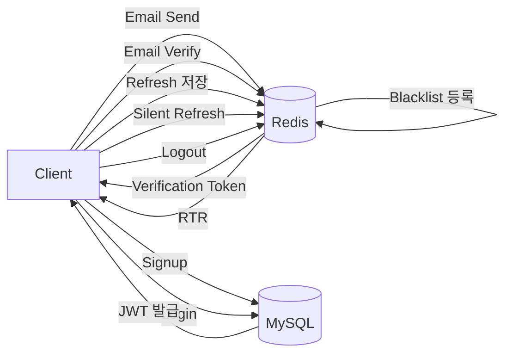

# Redis Policy

## 1. 개요

Redis는 Pickii 서비스에서 **JWT 기반 인증(Authentication)** 및 **세션(Session) 관리**를 위한 In-Memory Database로 사용한다.

영구적으로 보관할 필요가 없는 인증 정보를 저장하며, 모든 데이터는 **TTL(Time To Live)** 기반으로 자동 삭제된다.

Redis는 다음 기능을 담당한다.

- Refresh Token 저장
- Refresh Token Rotation(RTR)
- Access Token Blacklist 관리
- Email Verification Code 관리
- Verification Token 관리

---

# 2. 인증 구조

## JWT 인증 방식

```
                Login

                 │
                 ▼

        Access Token 발급
        Refresh Token 발급

                 │

                 ▼

        Refresh Token 저장
             (Redis)

                 │

                 ▼

       Access Token 만료

                 │

                 ▼

      Refresh Token 검증

                 │

                 ▼

      새로운 Access Token 발급

      (RTR 적용 시 Refresh Token도 교체)
```

---

# 3. Redis Key 구조

```
Redis
└── auth
    ├── refresh
    │   └── {MemberId}:{DeviceId}
    │
    ├── blacklist
    │   └── {AccessToken}
    │
    ├── code
    │   ├── {Purpose}:{Email}
    │   └── ip
    │       └── {IP}
    │
    └── verify
        └── {UUID}
```

---

# 4. Refresh Token

## 목적

Refresh Token은 Access Token이 만료되었을 때 새로운 Access Token을 발급하기 위해 사용한다.

Redis는 기기(Device) 단위로 Refresh Token을 관리한다.

동일한 기기에서 다시 로그인하면 기존 Refresh Token은 덮어쓴다.

Refresh Token Rotation(RTR)을 적용하여 재발급 시 기존 Token은 즉시 폐기된다.

---

## Key

```text
auth:refresh:{MemberId}:{DeviceId}
```

예시

```text
auth:refresh:15:device-uuid-1234
```

---

## Value

```json
{
    "refreshToken":"eyJhbGciOiJIUzI1NiJ9...",
    "issuedAt":"2026-07-09T21:00:00",
    "deviceUUID":"device-uuid-1234",
    "lastUsedAt":"2026-07-09T21:00:00"
}
```

---

## Value 설명

| 필드           | 타입       | 설명                |
|:------------ |:-------- |:----------------- |
| refreshToken | String   | JWT Refresh Token |
| issuedAt     | DateTime | 최초 발급 시간          |
| deviceUUID   | String   | 기기 식별 UUID        |
| lastUsedAt   | DateTime | 마지막 사용 시간         |

---

## TTL

| autoLogin | TTL              |
|:--------- |:---------------- |
| false     | 1일 (86,400초)     |
| true      | 30일 (2,592,000초) |

---

## Rotation

Silent Refresh 성공 시

```
기존 Refresh Token 삭제

↓

새 Refresh Token 생성

↓

Redis 저장

↓

기존 Refresh Token 사용 불가
```

---

# 5. Access Token Blacklist

## 목적

JWT는 Stateless 방식이므로 로그아웃 시 Access Token을 삭제할 수 없다.

따라서 남은 유효시간 동안 Blacklist에 등록하여 인증을 차단한다.

---

## Key

```text
auth:blacklist:{AccessToken}
```

예시

```text
auth:blacklist:eyJhbGciOiJIUzI1NiJ9...
```

---

## Value

```json
{
    "memberId":15,
    "reason":"LOGOUT"
}
```

---

## Value 설명

| 필드       | 타입     | 설명    |
|:-------- |:------ |:----- |
| memberId | Long   | 회원 PK |
| reason   | String | 등록 사유 |

---

## TTL

```
Access Token의 남은 만료 시간
```

최대

```
1800초
```

---

## JWT Filter 동작

```
Access Token

↓

Blacklist 조회

↓

있음

↓

401 Unauthorized

↓

없음

↓

JWT 검증

↓

인증 성공
```

---

# 6. Email Verification Code

## 목적

회원가입

비밀번호 재설정

회원탈퇴

과정에서 이메일 인증을 수행하기 위한 6자리 숫자 인증코드를 저장한다.

---

## Key

```text
auth:code:{Purpose}:{Email}
```

예시

```text
auth:code:SIGNUP:example@email.com
```

---

## Value

```text
482019
```

---

## TTL

```
180초
```

또는

```
300초
```

---

## 인증 성공

```
Code 비교

↓

성공

↓

Redis DEL

↓

Verification Token 발급
```

---

## 요청 제한 (Rate Limit)

동일 이메일/IP로부터의 반복 요청을 제한한다.

### 이메일 기준 (재발송 쿨다운)

```text
auth:code:{Purpose}:{Email}
```

위 Key가 이미 존재하면(= 이전에 보낸 인증코드가 아직 TTL 180초 이내) 재발송을 거부한다.
별도의 Key를 추가하지 않고 기존 인증코드 Key의 존재 여부로 판단한다.

### IP 기준

```text
auth:code:ip:{IP}
```

| 항목  | 값                |
|:--- |:----------------- |
| Value | 요청 횟수 (INCR)     |
| TTL   | 10분 (첫 요청 시 설정)  |
| 제한   | 10분 내 5회 초과 시 거부 |

두 조건 중 하나라도 걸리면 `429 TOO_MANY_REQUESTS`를 반환한다.

---

# 7. Verification Token

## 목적

이메일 인증 또는 닉네임 중복 확인 이후 최종 API를 호출하기 위한 일회성 인증 토큰이다.

회원가입

비밀번호 변경

회원탈퇴

등에서 사용된다.

---

## Key

```text
auth:verify:{UUID}
```

예시

```text
auth:verify:550e8400-e29b-41d4-a716-446655440000
```

---

## Email 인증 Value

```json
{
    "verificationType":"EMAIL",
    "purpose":"SIGNUP",
    "email":"example@email.com"
}
```

---

## Nickname 인증 Value

```json
{
    "verificationType":"NICKNAME",
    "nickname":"pickii"
}
```

---

## TTL

```
900초
```

---

## 사용 순서

```
이메일 인증 성공

↓

Verification Token 생성

↓

Redis 저장

↓

회원가입 API 호출

↓

검증 완료

↓

DEL
```

---

# 8. 인증 데이터 흐름



---

# 9. 운영 정책

| 항목                     | 내용            |
|:---------------------- |:------------- |
| 저장소                    | Redis         |
| 인증 방식                  | JWT           |
| Access Token 저장        | X             |
| Refresh Token 저장       | O             |
| Refresh Token Rotation | O             |
| Blacklist              | O             |
| Email Verification     | O             |
| Verification Token     | O             |
| 세션 관리                  | Stateless JWT |
| 데이터 삭제                 | TTL 자동 삭제     |

---

# 10. 장애 정책

Redis는 인증을 위한 임시 저장소이다.

Redis 데이터는 영구 복구 대상이 아니다.

Redis 장애 발생 시

- Refresh Token 소실
- Email 인증코드 소실
- Verification Token 소실

사용자는 다음 절차를 다시 수행한다.

- 로그인
- 이메일 인증
- 비밀번호 재설정

Redis 재시작 후 별도의 데이터 복구는 수행하지 않는다.
